# Practica 2

## Instalación del servidor web Nginx

Lo primero es lo primero, hay que actualizar, por lo que usamos ```sudo apt update``` y una vez hecho eso, instalamos NGinx mediante ```sudo apt install nginx```


Podemos comprobar que todo está en orden así:

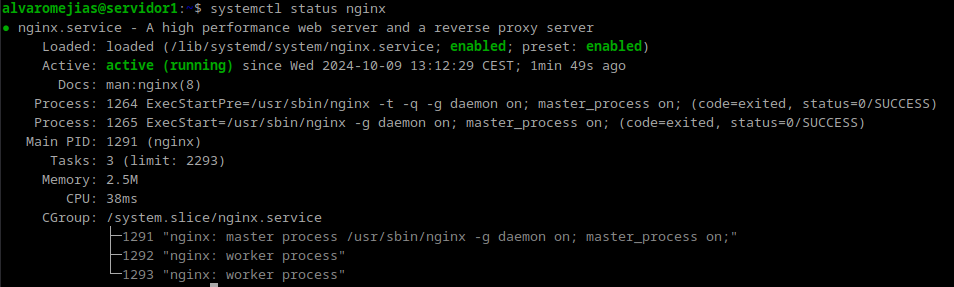

## Creación del directorio

Una vez hecho esto, nos creamos nuestro directorio:


*Nota: Al comprobar que la web funcionaba correctamente con http y https caí en la cuenta de que el dominio www.alvaro.com ya estaba en uso, por lo que puede que en las capturas el nombre del directorio esté cambiado de:*

`alvaro -> alvaro_web_imposiblequeestepillado`

Ahora tenemos que clonar el repositorio que aparece en la guía, asíque necesitamos tener instalado git.


Y ahora sí, clonamos el repositorio y nos damos permiso:


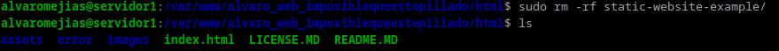

Podemos comprobar que hasta ahora va todo bien si en el navegador introducimos la ip de la máquina y sale lo siguiente:

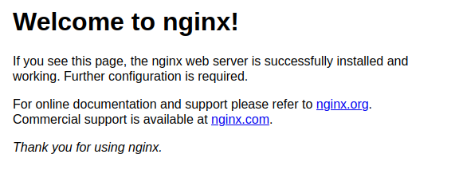

## Configuración del servidor

Necesitamos editar el siguiente archivo:

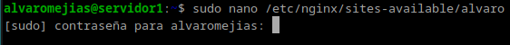

E introducimos esto:

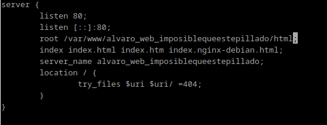


## Comprobaciones

Ahora en nuestra máquina física debemos modificar el archivo hosts, en mi caso (Windows) en `System32\drivers\etc\hosts`.


*Nota: El puerto indicado no es el correcto, solo lo puse a modo de placeholder, puesto que al estar cambiando de ubicación constantemente (instituto y mi lugar de residencia) no introduje la correcta. El nombre web por otra parte, como se ha indicado anteriormente, tampoco es el definitivo.*

## FTP

Ahora toca la parte de FTP:

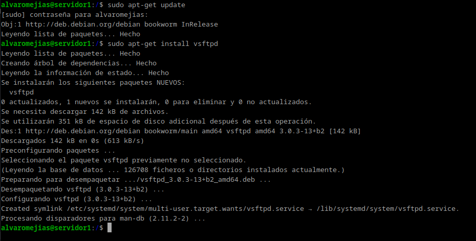
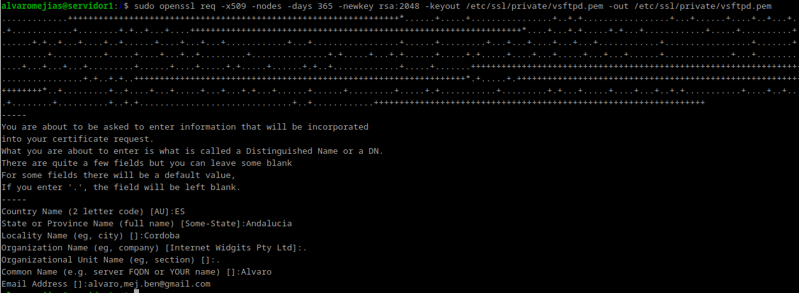

Y en el archivo `/etc/vsftpd.conf` buscamos esto:


Y lo cambiamos por esto:


Ahora tendremos que instalar el cliente de FileZilla en nuestra máquina física para realizar la prueba.


*Nota: Me he conectado por el puerto 22*

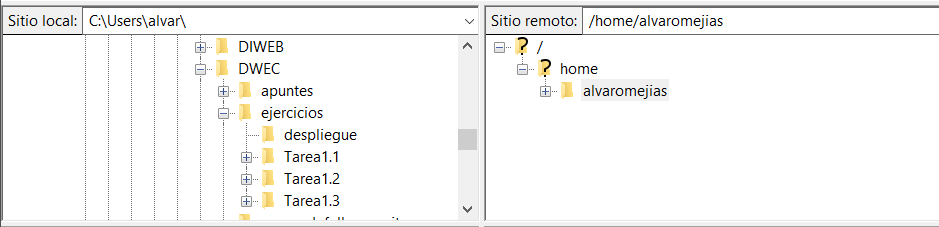

Hacemos click derecho en cualquier archivo que queramos subir (en mi caso, la carpeta *despliegue*) y nos dejará subirla sin ningún problema.

## HTTPS

Para el apartado de HTTPS, tenemos que modificar `sites-enabled`:

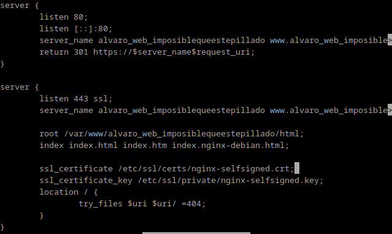

Nos damos permisos y reiniciamos:

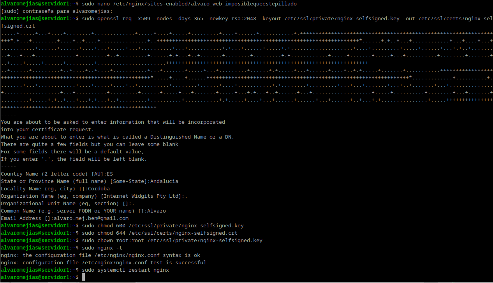

Y como podemos comprobar, funciona:

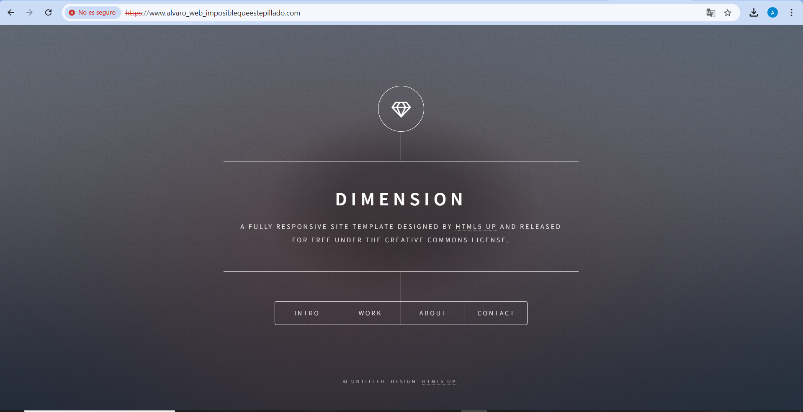

*Nota: En mi caso, no borro el directorio html porque tengo el root en ese directorio.*